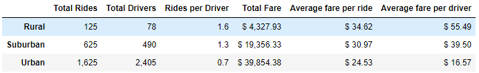

# Module 5 Challenge: PyBer by matplotlib

## Overview of the analysis: 

This analysis reviewed the ride and fare records for Jan-Apr 2019. A few business recommendations were made based on the observations.

## Results: 

When summarized according to city types, the total fare is highest for urban cities and lowest for rural cities, which is reasonable due to the difference in the total rides among different city types. On the other hand, the average fare per ride and per driver are the highest for the rural cities. This might to be due to the lack of drivers in rural cities.

Below is the figure of weekly fares by three cities types. The relative amount among different city types is consistant with the above table. It also indicates that the weekly fares are stable from January to April in 2019.

## Summary: 

Using my limited knowledge in economical principles, three recommendations can be made to address the disparities among the city types.

1. The number of rural drivers are relatively scarce comparing to the urban drivers. Therefore, increasing the rural drivers might be helpful to capture more business opportunities.

2. The average fare per ride in the rural and suburban cities are ~ 25% and 50% higher than the urban cities, respectively. Lowering the fares for these two city types may help address the disparity as well.

3. In the table, the Rides per Driver value indicates that the urban drivers have only 0.6 ride per driver for Jan-Apr 2019, which seems very low depending on the economical background. It might be worthwhile to evaluate the pros-and-cons of reducing the urban drivers and its impact on total fares.